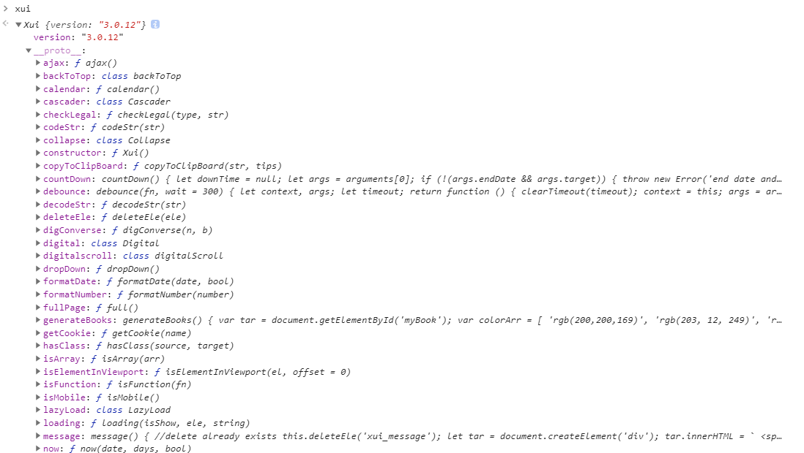

<link rel="stylesheet" type="text/css" href="../assets/xui.css">
<script type="text/javascript" src="../assets/xui.js"></script>

# 2.1.1 方法集合

#### 这里将会是方法集合

1.接上文,我想知道今天再加上5天的日期呢?
```js
xui.now(xui.now(), 5); //返回今天之后5天的日期;
xui.now(xui.now(), 5, true); //返回今天之后5天的日期(包含时分秒);
xui.now(xui.now(), -5); //是的,你也可以传负数,表示今天之前5天的日期.
xui.now(xui.now('2017/11/01'), -5); //嗯,你还可以自定义日期和天数,是不是非常棒!
```

2.我想验证手机号,咋办?很简单,只需要传入2个参数,验证类型(名字,手机号,邮件)和对应的`str`,返回一个`boolean`
```js
xui.checkLegal(type, str);
```

3.想获取`url`的某个参数呢?
```js
xui.queryString(str);
```

4.有时候后台传给我们一个数据库存放的日期,就需要前端来进行转换一下.第一个参数是传入的日期,第二个是`Boolean`,如果是`true`的话就精确到时分秒,否则就是年月日
```js
xui.formatDate(date, bool);
```

5.有时候为安全着想,我们需要把字符串符合等编码一下,那么传入相应的字符串即可, `codeStr`为编码,`decodeStr`为解码.
```js
xui.codeStr(str);
xui.decodeStr(str);
```

6.随机输出一个在xx到xx的范围内数字(包含边界)呢?
```js
xui.randomNum(1, 10);  //参数是从小到大排的
```

7.记录用户行为轨迹`get`方式请求

<script>
xui.recordData({
	data: {
		name: 'xui.js',
		version: xui.version,
	},
	url: 'https://xumeng.site/?a=1&b=2',
});
</script>

```js
/*
传入需要统计的参数列表(对象形式)和异步接口地址API.
不用担心跨域问题哦!
只能以get方式请求.
*/
xui.recordData({
	data: {
		name: 'xui.js',
		version: xui.version,
	},
	url: 'https://xumeng.site/?a=1&b=2',
});
```

8.有时候我们想操作一下`cookie`,但是原生的操作方法过于繁琐,所以便捷的方法显得格外重要.

```js
//`cookie`名和value必传
xui.setCookie(name, value, days, path)

//传入需要的cookie名即可,没有返回空
xui.getCookie(name)

//传入需要的cookie名即可删除`cookie`
xui.removeCookie(name)
```

9.这里使用`Promise`封装的一个`ajax`异步请求,使用方法如下
```js
//get请求
var url = 'https://hq.tigerbrokers.com/fundamental/finance_calendar/getType/2017-02-26/2017-06-10';
xui.ajax({
    url: url + '?name=vuejs',
    type: 'get',
}).then(res =>{
    console.log(res);
}, error =>{
    console.log(error)
});

//这里是post请求
xui.ajax({
    url: url,
    type: 'post',
    params: {
        x: 1,
        y: 2,
        z: 3,
    },
}).then(res =>{
    console.log(res);
}, error=>{
    console.log(error);    
});
```

10.我才不会告诉你,使用下面的方法可以快速判断当前环境是否为手机端
```js
xui.isMobile()   //返回boolean

//有兴趣查看源码么?
return Math.random() > .5 
    ? 
    /(iPhone|iPad|iPod|iOS|Android)/i.test(navigator.userAgent)
    :
    'ontouchstart' in window;
```

11.用过目前很火的`vue`(其他的不熟悉, 暂不考虑),双向绑定格外吸引人注意,那么它是如何做出开的呢?
先看看下面的例子吧

>说明:用到的是`es5`里的`Object.defineProperty`,不支持`IE`8及以下(同样IE9也是bug众多).详情请戳[mdn介绍](https://developer.mozilla.org/zh-CN/docs/Web/JavaScript/Reference/Global_Objects/Object/defineProperty)

<div class="xui_item">
    <label>手机号: </label>
    <div class="xui_content">
        <input type="text" id="demo" maxlength="11" class="xui_input" placeholder="输入手机号试试呢" />
    </div>
</div>

<div>
    手机号为:
    <span id="display"></span>
</div>

<script type="text/javascript">
    xui.twoWayBinding('#demo', '#display');
</script>

```html
<div class="xui_item">
    <label>手机号: </label>
    <div class="xui_content">
        <input type="text" id="demo" maxlength="11" class="xui_input" placeholder="输入手机号试试呢" />
    </div>
</div>
<div>
    手机号为:
    <span id="display"></span>
</div>
```

```js
xui.twoWayBinding('#demo', '#display');
```

12.如何将金额格式化，这是一个问题，比如￥1234567890.12，可以用这个方法展示

<div class="formatMoney"></div>

<script type="text/javascript">
    document.querySelector('.formatMoney').innerHTML = '￥' + xui.formatNumber(1234567890.12);
</script>

```js
document.querySelector('.formatMoney').innerHTML = '￥' + xui.formatNumber(1234567890.12);
```

* 更多方法详见`xui.js`,可以在控制台打印一下`xui`对象,你就知道所有的方法啦!

>说明:点击查看大图哦!还可以像风一样旋转,跳跃,奔跑，不定期更新（想起来就更新）



<script type="text/javascript">
document.getElementById('xui').onclick = function(e){
    xui.showImg(e.target.src, 'xui');
};
</script>